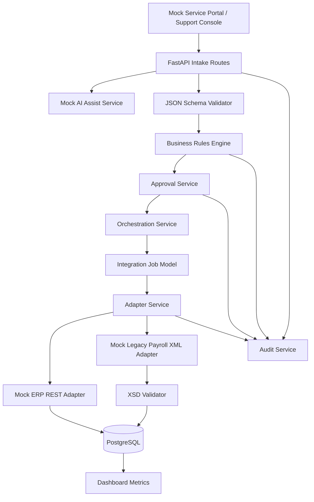
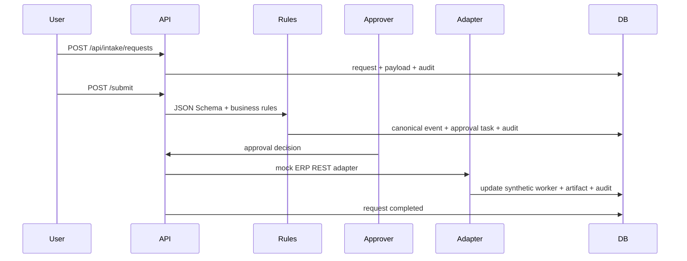
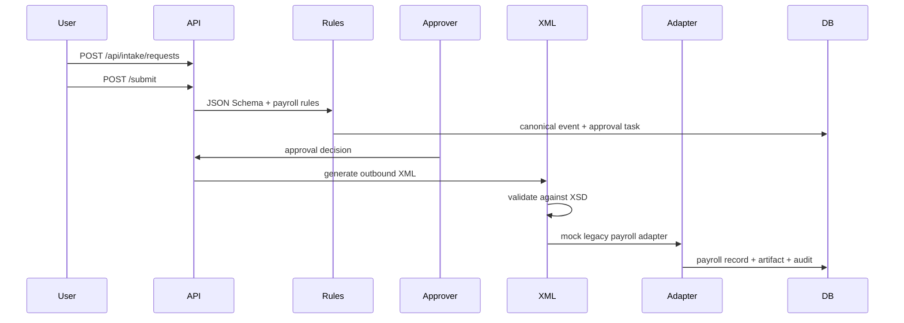

# Architecture

## Component Diagram

## Worker Change Sequence

## Payroll Correction Sequence

## Deterministic Validation

Validation is layered:

- JSON Schema validates inbound payload shape.
- Business rules validate dates, worker existence, priority, and approval requirements.
- XSD validates payroll outbound XML.
- AI output is not accepted as final validation.

## Adapter Layer

The adapter layer receives canonical events and writes synthetic downstream records. It intentionally uses generic names: mock ERP REST system and mock legacy payroll system. There are no fake Workday tenants, credentials, endpoints, or official system names.

## Runtime Contract

The main workflow is deliberately service-layer driven rather than route-handler driven:

- `intake_service` creates requests, hashes payloads, applies idempotency, writes audit events, and creates canonical events.
- `approval_service` records human decisions and hands approved requests to orchestration.
- `orchestration_service` creates integration jobs, runs adapters, records retryable/permanent failures, and updates request/job status.
- `adapter_service` writes JSON/XML artifacts and mutates only synthetic downstream tables.
- `audit.write_audit_event` is the single normal path for audit event creation.

## Retry And Failure Path

`simulate_failure=transient` fails the first adapter attempt and allows `POST /api/jobs/{job_id}/retry` to complete the job. `simulate_failure=permanent` creates a permanent failure and retry returns a conflict.

## AI Boundaries

AI assist can summarize, suggest type, hint missing fields, and draft next action. It never approves, writes records, validates finally, changes permissions, or creates audit truth.
