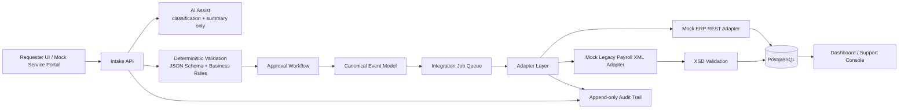

# Campus ERP Integration Bridge

**A Workday-adjacent Adapter & Audit Trail Prototype using Synthetic Data**

Campus ERP Integration Bridge demonstrates enterprise integration patterns for campus-style HR/HCM and payroll requests: intake, validation, approvals, canonical mapping, adapters, retry handling, and audit trails.

- Live demo: https://demo.gaoyuze.com/
- API docs: https://demo.gaoyuze.com/docs
- Application package: [APPLICATION_PACKAGE.md](APPLICATION_PACKAGE.md)

This is a synthetic, Workday-adjacent ERP-style integration prototype. It is not an official UBC project, does not use UBC branding or data, and does not connect to Workday.

Enterprise proof points:

- API intake with idempotency keys and correlation IDs.
- Deterministic JSON Schema and business-rule validation.
- Human approval routing before downstream writes.
- Canonical event model feeding mock REST and XML adapters.
- Retry/error handling with append-only audit events and support visibility.

Supported flows:

- Worker Change Request: JSON Schema, manager approval, canonical HCM mapping, mock ERP REST adapter, audit timeline.
- Payroll Correction Request: JSON Schema, payroll approval, XML generation, XSD validation, mock legacy payroll adapter, retry/failure path.

AI boundary: AI is assistive only for summaries/classification hints; it never approves, validates finally, writes records, or creates audit truth.

## Why This Exists

Large institutions need reliable workflows for HR/HCM and payroll-style operational requests. This prototype demonstrates the integration patterns behind that work: API intake, deterministic validation, approval routing, canonical mapping, mock adapter execution, retry/error handling, support visibility, and append-only audit logging. AI is assistive only.

## Core Flows

- **Worker Change Request**: request intake, JSON Schema validation, manager approval, canonical HCM event mapping, mock ERP REST adapter execution, audit timeline.
- **Payroll Correction Request**: request intake, JSON Schema validation, payroll reviewer approval, canonical payroll event mapping, XML generation, XSD validation, mock legacy payroll adapter execution, retry/failure handling, audit timeline.

## 2-Minute Demo Path

1. Open the dashboard and point out request counts, approval state, failed jobs, and audit-first positioning.
2. Create a Worker Change from **New Request**, open the request detail, submit it, approve it, and show the completed adapter job.
3. Open the audit timeline and show schema validation, business rules, approval, adapter execution, and completion events.
4. Mention the payroll flow adds XML generation, XSD validation, transient failure, and retry.

## Architecture Summary



## Portfolio Proof Points

| Capability | Where to inspect |
| --- | --- |
| API intake and idempotency | `app/routes/intake.py`, `app/services/intake_service.py`, `tests/test_idempotency.py` |
| JSON Schema validation | `schemas/*.schema.json`, `app/validation/json_schema_validator.py`, `tests/test_json_schema_validation.py` |
| Business rules and approval routing | `app/validation/business_rules.py`, `app/services/approval_service.py` |
| Canonical event model | `app/services/intake_service.py`, request detail page after submit |
| Mock REST and XML adapters | `app/services/adapter_service.py`, `app/adapters/`, `tests/test_worker_change_flow.py`, `tests/test_payroll_correction_flow.py` |
| XML/XSD validation | `schemas/payroll_correction_outbound.xsd`, `app/validation/xml_validator.py`, `tests/test_xml_xsd_validation.py` |
| Retry/error handling | `app/services/retry_service.py`, `tests/test_retry_flow.py` |
| Append-only audit trail | `app/audit.py`, `app/models.py`, `tests/test_audit_log.py` |
| AI boundary | `app/services/ai_assist_service.py`, `tests/test_ai_boundaries.py` |
| Support console UI | `app/templates/`, `tests/test_web_pages.py` |

## Fresh Clone Quick Start

```bash
git clone <repo-url>
cd campus-erp-integration-bridge
cp -n .env.example .env
docker compose up --build -d
docker compose exec app python -m scripts.seed_demo_data
```

Open:

- App: http://127.0.0.1:4910
- API docs: http://127.0.0.1:4910/docs
- Health: http://127.0.0.1:4910/health

The host port defaults to `4910` to avoid common conflicts. Change `APP_HOST_PORT` in `.env` if needed.

## Run Tests

```bash
docker compose build app
docker compose run --rm app pytest -q
```

## API Contract Map

| Area | Endpoint |
| --- | --- |
| Health | `GET /health` |
| Demo data | `POST /api/demo/seed`, `DELETE /api/demo/reset`, `GET /api/demo/sample-payloads` |
| Intake | `POST /api/intake/requests`, `GET /api/intake/requests`, `GET /api/intake/requests/{request_id}`, `POST /api/intake/requests/{request_id}/submit` |
| Approvals | `GET /api/approvals/pending`, `POST /api/approvals/{approval_id}/decision` |
| Jobs and retry | `GET /api/jobs`, `GET /api/jobs/{job_id}`, `POST /api/jobs/{job_id}/retry` |
| Audit | `GET /api/audit/requests/{request_id}` |
| Dashboard metrics | `GET /api/dashboard/metrics` |
| AI assist | `POST /api/ai/request-summary` |

## Demo Samples

```bash
curl -s http://127.0.0.1:4910/api/demo/sample-payloads
```

Example create request:

```bash
curl -s -X POST http://127.0.0.1:4910/api/intake/requests \
  -H 'Content-Type: application/json' \
  -H 'X-Correlation-Id: demo-corr-worker-1' \
  -H 'Idempotency-Key: demo-worker-1' \
  -d @sample_payloads/worker_change_valid.json
```

## Key Design Decisions

- AI assists with summary/classification only; it does not approve, validate finally, write records, or create audit truth.
- Mutating intake supports `Idempotency-Key` and `X-Correlation-Id`.
- Payroll flow includes XML generation and XSD validation to show legacy/SOAP-adjacent thinking without claiming real Workday access.
- Audit events are written as append-only service-layer events during normal flows.
- All names, users, workers, departments, requests, and policies are synthetic.

## Known Limitations

- This does not use Workday Extend, Workday Orchestrate, a Workday tenant, or real Workday APIs.
- The UI is intentionally minimal; the proof-of-work is the integration/audit behavior.
- OAuth2, ServiceNow/Jira sync, and second-level finance approval are documented stretch items, not MVP behavior.
- Audit immutability is enforced by service design in MVP; a database trigger is a production hardening step.
